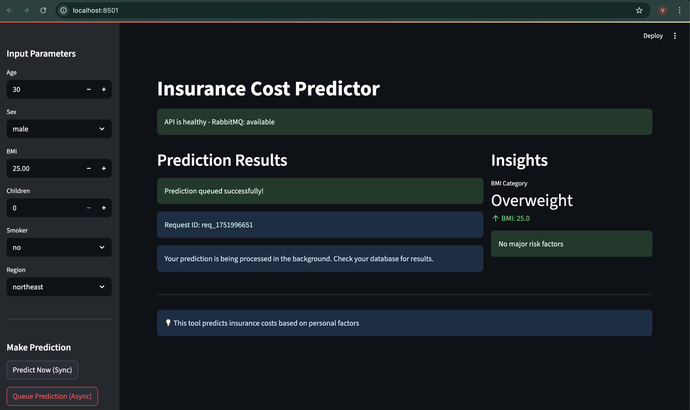
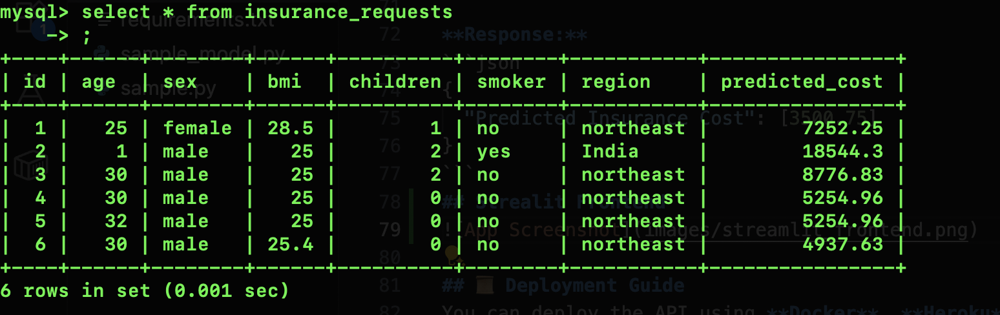

# FastAPI-Based Machine Learning Model Serving

## 📌 Project Overview
This project demonstrates how to deploy a machine learning model using **FastAPI** and **PyCaret**. The goal is to serve a trained model as a RESTful API that can make real-time predictions.

## 🚀 Features
- End-to-end machine learning pipeline using PyCaret.
- FastAPI for serving the model as an API.
- Supports real-time predictions via HTTP requests.
- Can be easily integrated with web applications or other services.

## 📂 Project Structure
```
📁 fastapi-ml-api
│── model/
│   └── my_model.pkl   # Pre-trained ML model
│── main.py             # FastAPI application
│── requirements.txt   # Python dependencies
│── README.md          # Project documentation
```

## 🛠 Installation
### 1️⃣ Clone the Repository
```bash
git clone https://github.com/yourusername/fastapi-ml-api.git
cd fastapi-ml-api
```

### 2️⃣ Create a Virtual Environment (Optional but Recommended)
```bash
python -m venv venv
source venv/bin/activate  # On Windows, use: venv\Scripts\activate
```

### 3️⃣ Install Dependencies
```bash
pip install -r requirements.txt
```

## 🎯 Running the API
```bash
uvicorn app:app --host 127.0.0.1 --port 8000 --reload
```
This will start the FastAPI server at **http://127.0.0.1:8000**.

## 📡 API Endpoints
### 1️⃣ Health Check
```http
GET /
```
**Response:**
```json
{"message": "API is running"}
```

### 2️⃣ Make a Prediction
```http
POST /predict
```
**Request Body (JSON Example):**
```json
{
  "age": 30,
  "sex": "male",
  "bmi": 25.5,
  "children": 2,
  "smoker": "no",
  "region": "southwest"
}
```

**Response:**
```json
{
  "Predicted Insurance Cost": [3500.75]
}
```
## Strealit Frontend


## MySQL Screenshot


## 📜 Deployment Guide
You can deploy the API using **Docker**.

### 🐳 Run with Docker
1. Build the Docker Image:
```bash
docker build -t fastapi-ml .
```
2. Run the Container:
```bash
docker run -p 8000:8000 fastapi-ml
```

## 🔗 References
- [FastAPI Documentation](https://fastapi.tiangolo.com/)
- [PyCaret Documentation](https://pycaret.gitbook.io/docs/)

## 💡 Future Enhancements
- Implement authentication for API access.
- Deploy on cloud platforms like AWS/GCP.

## ✨ Contributors
- **Your Name** (your_email@example.com)

---
### 🌟 Feel free to ⭐ the repo and contribute! Happy coding! 🚀

